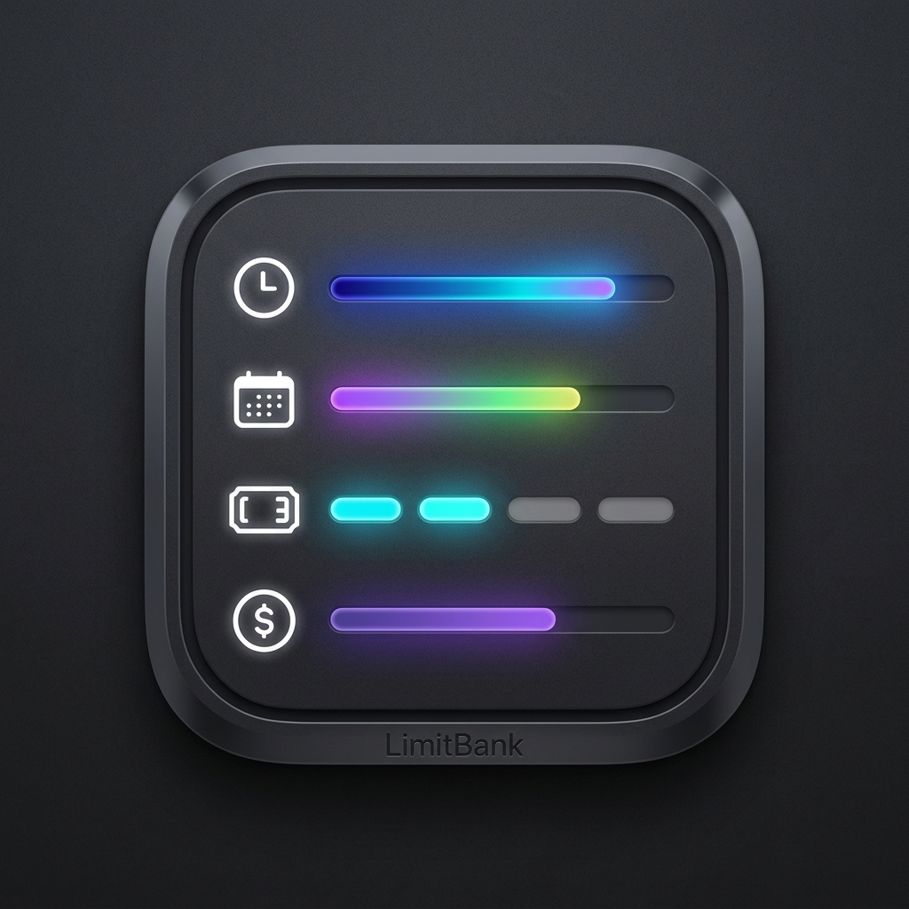

<p align="center">
  
</p>

<h1 align="center">LimitBank</h1>

<p align="center">
  A native macOS menu bar app for monitoring and switching Codex and Antigravity usage limits across multiple accounts.
</p>

<p align="center">
  <a href="https://github.com/dendyelo/LimitBank/releases">Download</a>
  ·
  <a href="#features">Features</a>
  ·
  <a href="#account-workflows">Account Workflows</a>
  ·
  <a href="#build-from-source">Build from Source</a>
</p>

## Overview

LimitBank keeps your Codex and Antigravity account limits visible from the macOS menu bar. It is designed for developers who manage multiple sessions and want a safer way to switch active accounts without losing saved credentials.

The app stores account sessions in a local account bank, refreshes quota data in the background, and can activate a selected account by writing the correct session back to Codex or Antigravity.

## Screenshots

<p align="center">
  
  &nbsp;&nbsp;&nbsp;&nbsp;
  
</p>

## Features

- **Menu bar quota dashboard**: view remaining 5-hour and weekly limits at a glance.
- **Multi-account bank**: add, remove, reorder, save, and monitor multiple Codex and Antigravity accounts.
- **Codex session switching**: save ChatGPT-backed Codex sessions, activate a selected account, refresh tokens, update `~/.codex/auth.json`, quit ChatGPT, and reopen it when ready.
- **Antigravity session switching**: save Google login sessions, update the macOS Keychain entry used by Antigravity, quit Antigravity, and reopen it when ready.
- **Background refresh**: refresh quota data automatically with configurable intervals.
- **Transient error handling**: retry temporary Codex quota timeouts and keep the last valid quota on screen when the network is briefly unstable.
- **Native macOS UI**: SwiftUI popover, Settings sidebar, menu bar icon, Launch at Login, and configurable menu bar display style.
- **Local-first storage**: credentials and app state stay on your Mac.

## Supported Services

| Service | What LimitBank Tracks | Session Activation |
| --- | --- | --- |
| Codex | Plan, 5-hour usage, weekly usage, credits, and reset credits | Writes `~/.codex/auth.json`, then opens ChatGPT |
| Antigravity | Gemini and Claude/GPT 5-hour and weekly usage | Writes the active session to macOS Keychain, then opens Antigravity |

## Requirements

- macOS 14 Sonoma or later
- ChatGPT desktop app or Codex CLI installed
- Swift 5.9 or later, only when building from source

## Installation

### Download Release

1. Open the [Releases](https://github.com/dendyelo/LimitBank/releases) page.
2. Download the latest `LimitBank.zip`.
3. Unzip it and move `LimitBank.app` to `/Applications`.
4. Open the app.

LimitBank is currently unsigned. If macOS blocks the first launch, right-click `LimitBank.app`, choose **Open**, then confirm the prompt.

### Build from Source

```bash
git clone https://github.com/dendyelo/LimitBank.git
cd LimitBank
./build_app.sh
open LimitBank.app
```

For development builds:

```bash
swift build
swift run LimitBank
```

## Account Workflows

### Codex

1. Open **Settings** from the LimitBank menu.
2. Add or select a Codex account.
3. Click **Sign in with ChatGPT & Save** to run the official Codex CLI browser flow and save the account to LimitBank.
4. Repeat for each Codex account you want to store.
5. Click **Activate Codex Session** when you want to switch the active Codex account.

During Quick Setup, LimitBank closes ChatGPT before replacing the Codex login cache, saves the authenticated account, and restores the previous cache if sign-in fails. When activating a saved account, LimitBank closes ChatGPT, refreshes the selected session, writes a complete ChatGPT-mode `~/.codex/auth.json`, and opens ChatGPT again after the account is ready.

Tip: avoid signing out inside ChatGPT if you want LimitBank to keep the saved Codex session intact. Use **Activate Codex Session** to switch accounts instead.

### Antigravity

1. Open **Settings** from the LimitBank menu.
2. Add or select an Antigravity account.
3. Click **Login & Save with Google** to authenticate and save the account to LimitBank.
4. Repeat for each Antigravity account you want to store.
5. Click **Activate Antigravity Session** when you want to switch the active Antigravity account.

When activating an Antigravity account, LimitBank closes Antigravity if it is running, refreshes the saved Google session, writes the active credentials to macOS Keychain, and opens Antigravity again after the account is ready.

## Settings

LimitBank includes several app-level preferences:

- **Launch at Login**: start LimitBank automatically when you sign in to macOS.
- **Auto-Refresh Interval**: choose how often quota data is refreshed.
- **Menu Bar Style**: show progress bars, percentage text, or both.
- **Account ordering**: reorder accounts from the Settings sidebar context menu or by dragging cards in the popover.

## Local Data

LimitBank is local-first. It does not run a backend server and does not send your credentials to a LimitBank service.

Data is stored in these local locations:

- `~/.limitbank.json`: LimitBank account bank and saved sessions.
- `${CODEX_HOME}/auth.json` (normally `~/.codex/auth.json`): active Codex session written during Codex activation.
- macOS Keychain: active Antigravity session written during Antigravity activation.

Treat `~/.limitbank.json` as sensitive because it contains saved account session data.

## Troubleshooting

| Problem | What to Try |
| --- | --- |
| Codex quota briefly shows a timeout | This is usually a temporary `chatgpt.com` quota API timeout. LimitBank retries automatically and preserves the last valid quota when possible. |
| Codex account did not switch immediately | Quit older Codex builds if they are still running, then use **Activate Codex Session**. Current releases are reopened as the ChatGPT desktop app. |
| Google login page says login succeeded | Close the browser tab and return to LimitBank Settings. LimitBank will show a success message after the account is saved. |
| macOS blocks the app | Right-click `LimitBank.app`, choose **Open**, then confirm the security prompt. |
| OAuth callback fails | Make sure local port `12111` is not being used by another process, then try the login flow again. |

## Development Notes

- `build_app.sh` creates a release `LimitBank.app` bundle.
- `secrets.json` is optional and ignored by Git. Use `secrets.json.example` if you want to provide your own Google OAuth client credentials.
- `LimitBank.app`, `.build`, `.swiftpm`, and local secrets are intentionally ignored.

## License

LimitBank is released under the [MIT License](LICENSE).

## Author

Developed by [dendyelo](https://github.com/dendyelo).

LimitBank is an independent project and is not affiliated with OpenAI, Google, or the Antigravity product team.
