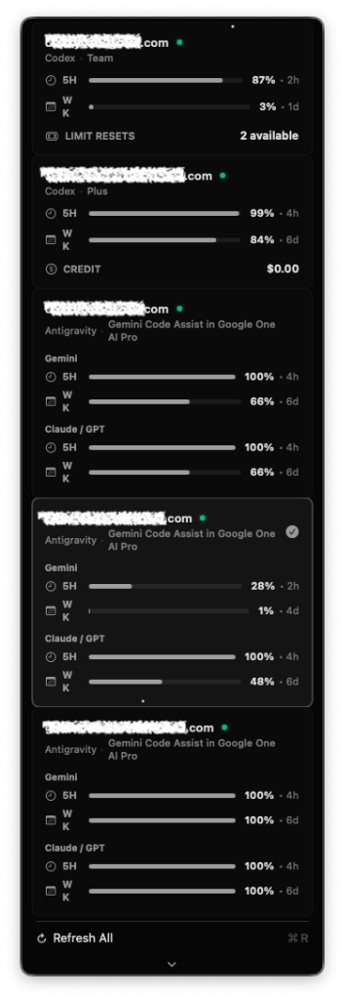
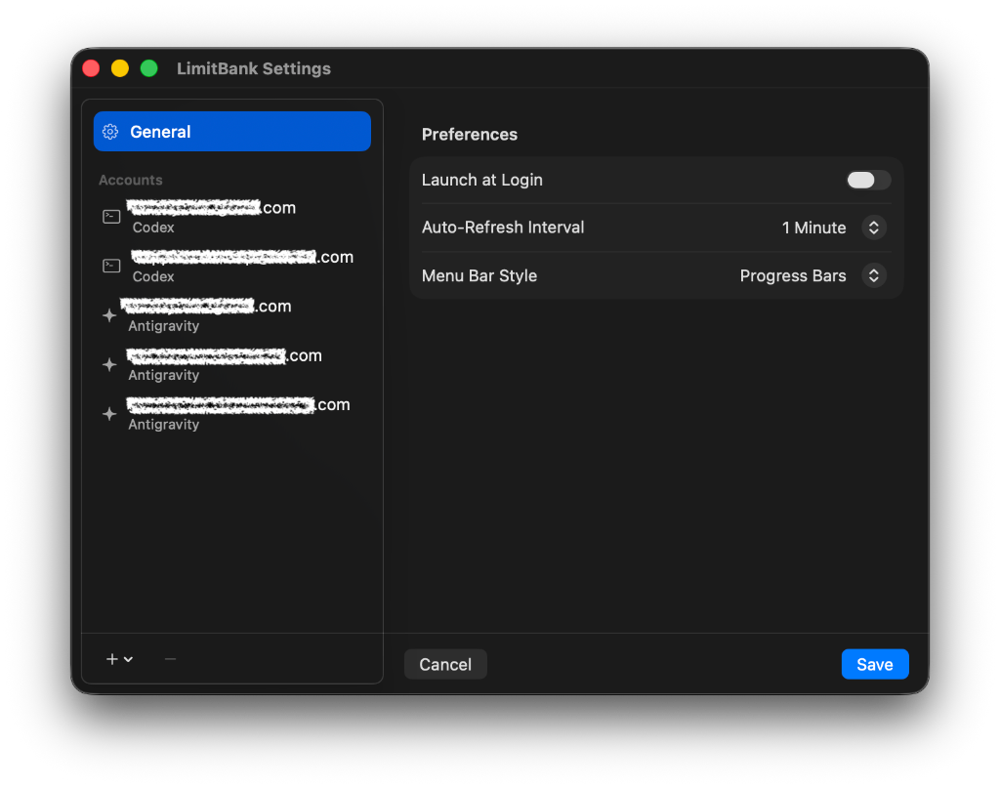

# LimitBank

LimitBank is a lightweight macOS menu bar utility designed for developers to monitor API quotas and token limits for Google Gemini (Antigravity) and OpenAI (Codex) accounts in real time.

## Screenshots

<p align="center">
  
  &nbsp;&nbsp;&nbsp;&nbsp;
  
</p>

## Features

- **Real-Time Quota Monitoring**: Tracks hourly, daily, weekly, and monthly limits with high-precision progress indicators directly from the macOS status bar.
- **Multi-Account Management**: Supports registering and monitoring up to 5 concurrent account slots (2 Codex slots, 3 Antigravity slots).
- **Native macOS Interface**: Designed with SwiftUI to provide a clean, responsive popover and a native system settings sidebar.
- **Isolated Sessions**: Authentication tokens are maintained independently of other applications and IDE extensions, avoiding credentials conflicts.
- **Automatic Sync and Integration**: Detects active sessions and performs background OAuth token refreshes. Integrates helper logic to refresh target application states upon session switching.
- **OAuth Loopback Server**: Runs a secure local loopback OAuth server on port 12111 to facilitate automated browser sign-in.

## System Requirements

- macOS 14.0 (Sonoma) or later
- Swift 5.9 or later (for manual compilation)

## Installation and Build

To compile and package LimitBank as a native macOS application bundle:

1. Clone this repository to your local machine.
2. Build the application structure by executing the build script:
   ```bash
   ./build_app.sh
   ```
3. Open the compiled application bundle:
   ```bash
   open LimitBank.app
   ```

## Configuration

- **Antigravity (Google Gemini) Accounts**: Select the account slot in Settings and click **Sign In via Google (Browser)** to complete authorization.
- **Codex (OpenAI) Accounts**: Click **Launch Codex CLI Login** to authenticate and switch active sessions.

## Privacy and Security

All authentication tokens, credentials, and state information are stored locally on your device within the file `~/.limitbank.json`. LimitBank does not transmit credentials or telemetry to any external servers.

---
Developed by [dendyelo](https://github.com/dendyelo). Built with Swift and SwiftUI.
